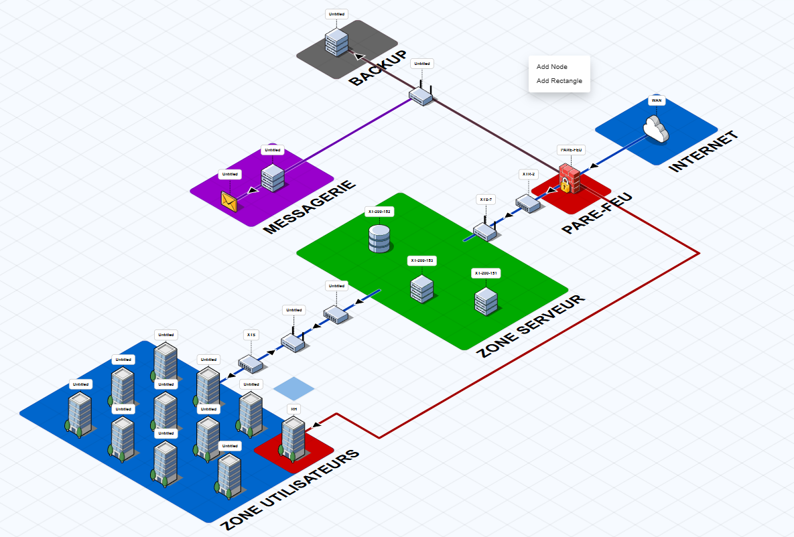

# TSSR-0226-P3-G4
# Projet 3 – Construction d’une infrastructure réseau

# Sommaire

1.  [**Notre projet**](#1-Notre-projet)
2.  [**Qui somme-nous ?**](#2-Xen-Tech)
3.  [**Objectifs finaux**](#3-objectifs-finaux)
4. [**Vue d'ensemble des composants**](#4-vue-densemble-des-composants)
5. [**Services déployés**](#5-services-déployés)
6. [**Retrouver notre documentation ici**](#7-Retrouver-notre-documentation-ici)

# 1. Notre projet
Ce projet a pour but **la conception** d'une infrastructure de réseau **sécurisé** pour la start-Up Xen-Tech, de la mise en place des outils a la maintenance de ceux-ci grace a la documentation faite tout au long du projet pour une maintenance claire et efficace.

# 2. Contexte actuelle de la start-up

On peut observer que pour l'heure cette start-up a une infrastructure presentant de nombreux **problemes** et/ou **manquemants** comme :
- Aucun serveur ni materiel réseau pour le moment.
- Il n'y a actuellement qu'un seul réseau pour toute l'entreprise.
- Le service de messagerie est hébergée sur un coud avec un format ultra basique.
- Il n'y a aucun matéiel servant a la sécurisation du réseau.
- Les anciens mot de passes sont recyclés pour le donner au nouveaux personnels.
- ...

Ce sont autant de **manquemants** de sécurité qui font de notre projet de **reconstruction totale** de l'infrastructure réseau un besoin **vitale** pour cette strat-up.

# 3. Objectifs finaux

### **Sécuriser et structurer le réseau**
Remplacer l'infrastructure réseau actuelle par une solution professionnelle dotée d'un firewall, d'une segmentation en VLANs par département et d'un plan d'adressage IP cohérent. Prévoir aussi les accès pour les partenaires externes et le télétravail via VPN.

### **Centraliser la gestion des utilisateurs**
Déployer un annuaire unique qui est alimenté par des données RH. Ce référentiel permettra de gérer les droits d'accès de l'ensemble des 218 collaborateurs et d'automatiser les procédures d'arrivée et de départ pour éviter tout compte orphelin ou obsolète.

### **Garantir la continuité et le suivi**
Mettre en place un stockage centralisé couplé à une stratégie de sauvegarde automatisée pour protéger les données de l'entreprise. Standardiser et inventorier le parc matériel hétérogène afin d'en assurer un suivi rigoureux, et passer à une administration monitorée et documentée.

# 4. Vue d'ensemble des composants

# 5. Services déployés

# 6. Retrouver notre documentation ici
### **Architecture** (HLD) 
Pour une compréhension de la conception globale de l'infrastructure cliquez-ici -> [architecture](architecture)
### **Components** (LLD) 
Pour avoir l'accès a tous les éléments de l'infrastructure cliquez-ici -> [components](components)
### **Opérations** (DEX)
Pour consulter la doc d'exploitation de l'infrastucture cliquez-ici -> [operations](operations)
### **Sprints** (chronologie)
Pour suivre l'avancement du projet sprint après sprint cliquez-ici -> [sprints](sprints)
