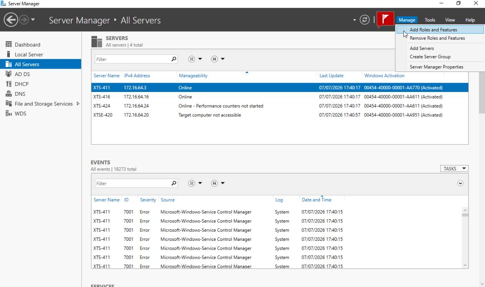
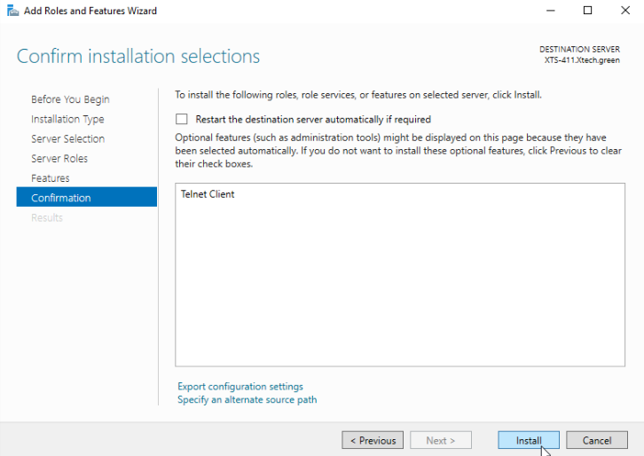
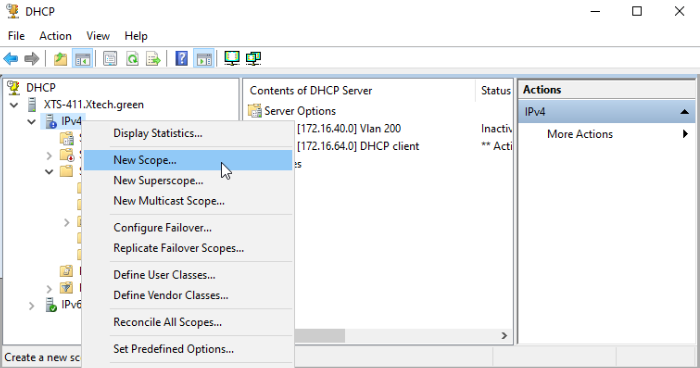
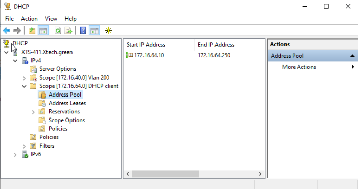
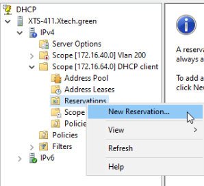
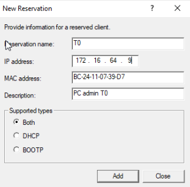
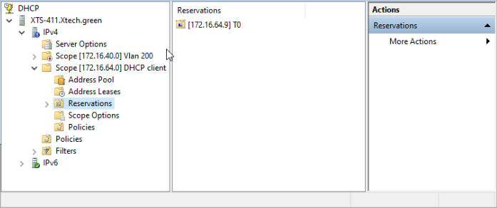

# Sommaire
1. [**Installation du roles DHCP**](#1-Installation-du-roles-DHCP)
2. [**Configuration des scopes DHCP**](#2-Configuration-des-scopes-DHCP)

## 1. Installer DHCP

Pour commencer on va ajouter le role DHCP sur le serveur Windows 2022 :  
Dans **manage** selectionner **add Roles and features**  

Puis cliquer trois sur **next** jusqu'a arriver a la selection de roles **cocher DHCP Server**  

Puis cliquer deux fois sur **next** jusqu'a arriver a **confirmation** et cliquer sur **install** pour lancer l'installation du role DHCP

## 2. Configuration des scopes DHCP
Nous avons fait le choix de ne donner des adresses dynamiques uniquement a nos clients, pour ce qui est des autres materiels servant a la mise en place de l'infrastructure réseau (serveurs,routeurs,...) nous avons mis en place des ip fixes.

Pour la configuration du DHCP simple avec un scope unique
- Clic droit puis **New Scope...**

Et voila le **scope** est configurer

Puis suivre le guide d'installation.

Pour réserver des adresses en cas d'adresse fixe reservée par exemple un pc admin:
- Clic droit sur **Reservations** puis **New Reservation...**

- Rentrer les **informations necessaires** puis cliquer sur **Add**

Et voila la **réservation** est **active**

En cas d'evolution de notre société nous pourrons faire de nouvelles reservations et scopes.

Ouvrir la console DHCP sur xts-411, autoriser le serveur et implémenter les étendues :

Scope [172.16.64.0] DHCP client

Scope [172.16.40.0] Vlan 200

Définir les options d'étendue indispensables :

Option 003 (Routeur) : IP de l'interface pfSense du VLAN concerné.

Option 006 (Serveurs DNS) : Configurer exclusivement l'IP du DC principal 172.16.64.3.

Option 015 (Nom de domaine) : Spécifier la valeur Xtech.green.
